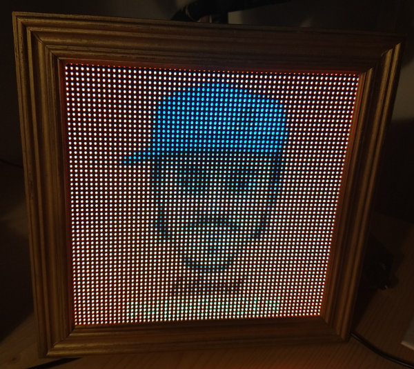
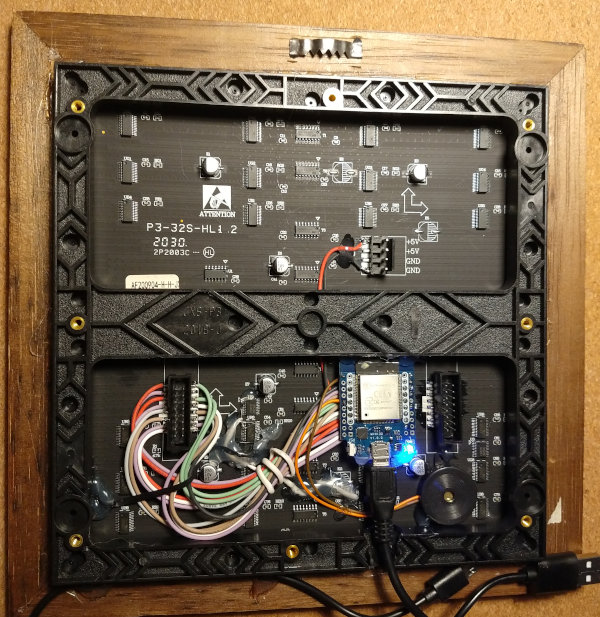

# Album Art Display

by Philippe Kehl <flipflip at oinkzwurgl dot org>,
https://oinkzwurgl.org/projaeggd/album-art-display




## Introduction

This displays the cover art of the currently playing music on a 64x64 pixel LED display ("HUB75E" type display).
It uses an ESP32 to get the cover art directly from the [Logitech Media Server (LMS)](https://github.com/Logitech/slimserver)
(a.k.a. Slimserver, Squeezebox server) and show it on the display. It connects to the LMS command line interface (CLI)
and subscribes for changes. When the state (play, pause, stop) or song changes it updates the display accordingly.

It uses the LMS CLI to find all players. It uses the first one currently playing.

When no player is playing random animations play instead of displaying the a cover art. Some animations are built-in
and others are GIF files (see data folder, see _Credits_ below).

Inspired by https://github.com/fspoettel/thirtytwopixels

## Building

Note: This is for Linux. Building this on other systems should work, but is your own problem... :-)

You will need the right [Arduino](https://www.arduino.cc/) board installed:
[Arduino core for ESP32](https://github.com/espressif/arduino-esp32).

### Preparation

Create a file `src/secrets.h` file based on [`src/secrets-example.h`](src/secrets-example.h) and set the SSID and
password for at least one network. Configure the server and port for the LMS.

### Makefile (recommended)

Build, flash and watch serial monitor:

```
$  make esp32-mini32-upload flash-spiffs monitor
```

Say `make help` for more information 

The build configurations are defined in the [`Makefile`](./Makefile), [`src/config-common.txt`](./src/config-common.txt)
and [`src/config-esp32-mini32.txt`](src/config-esp32-mini32.txt). Additional build configurations can be defined.

### Arduino IDE

(Untested. YMMV.)

You'll have to run the following script before building  (verifying or uploading the sketch):

```
$ ./tools/gen_config_h.pl <name>
```

Where `<name>` is the target name. For each target a file `src/config-<name>.txt` must exist.

The [arduino-esp32fs-plugin](https://github.com/me-no-dev/arduino-esp32fs-plugin) should work to create and flash the
SPIFFS image (untested).

## Debugging

The software produces text debug output on the serial port at baudrate 115200. Use the serial monitor in the Arduino IDE
or the provided `tools/debug.pl` script to display it on the screen. The `debug.pl` script will also colourise the
output.

## Hardware setup

The board is a "Wemos mini32 v1.0.0" (from https://www.bastelgarage.ch/esp32minikit-wemos), which seems similar or
identical to the "MH-ET LIVE MiniKit" (https://riot-os.org/api/group__boards__esp32__mh-et-live-minikit.html).

The HUB75 (HUB75E) pinout is as follows (male input socket on the back of the display):
```
                 ______
                /     /|
               +-----+ |
            R1 | o o | |G1
            B1 | o o | |(GND)
            R2 |/o o | |G2
            B2   o o | |(GND) E on HUB75E
             A  /o o | |B
             C | o o | |D
           CLK | o o | |LAT(CH) (STB)
    (BLANK) OE | o o |/ GND
               +-----+
```
Note that sometimes R1/G1/B1/R2/B2/G2 are labelled R0/G0/B0/R1/B1/G1 and sometimes the R/G/B lines are swapped.

The configuration for the LED display connection is set in the `src/config-<name>.txt` file.

## Credits, 3rd-party code

- Library for decoding PNG images: https://github.com/elanthis/upng
- Driver for HUB75 board: https://github.com/phkehl/esp32-leddisplay
- Original idea: https://github.com/fspoettel/thirtytwopixels
- LMS CLI documentation: https://github.com/elParaguayo/LMS-CLI-Documentation/blob/master/LMS-CLI.md
- GIF decoding library: https://github.com/bitbank2/AnimatedGIF
- GIF files: https://www.youtube.com/watch?v=kuuImQaW1Sw
- Photo: https://de.wikipedia.org/wiki/Bundesratsfoto
- See source code for more credits.

## Use customised ESP32 SDK

Update the board support to the latest release: Got to [espressif/arduino-esp32/releases](https://github.com/espressif/arduino-esp32/releases)
and find the link to the latest (e.g. https://github.com/espressif/arduino-esp32/releases/download/1.0.5-rc4/package_esp32_dev_index.json).
Add that link to Arduino config and update the board support in the boards manager.

Get this: https://github.com/espressif/esp32-arduino-lib-builder and do this:

```
$ IDF_PATH=/home/flip/sandbox/esp32-arduino-lib-builder/esp-idf make menuconfig
# Enable CONFIG_FREERTOS_USE_TRACE_FACILITY, CONFIG_FREERTOS_VTASKLIST_INCLUDE_COREID and
# CONFIG_FREERTOS_GENERATE_RUN_TIME_STATS to enable tasks list debugging.
$ ./build.sh
$ ESP32_ARDUINO=/home/flip/.arduino15/packages/esp32/hardware/esp32/1.0.5-rc4 ./tools/copy-to-arduino.sh
$ ln -s . ~/.arduino15/packages/esp32/hardware/esp32/1.0.5-rc4/tools/esptool
```
